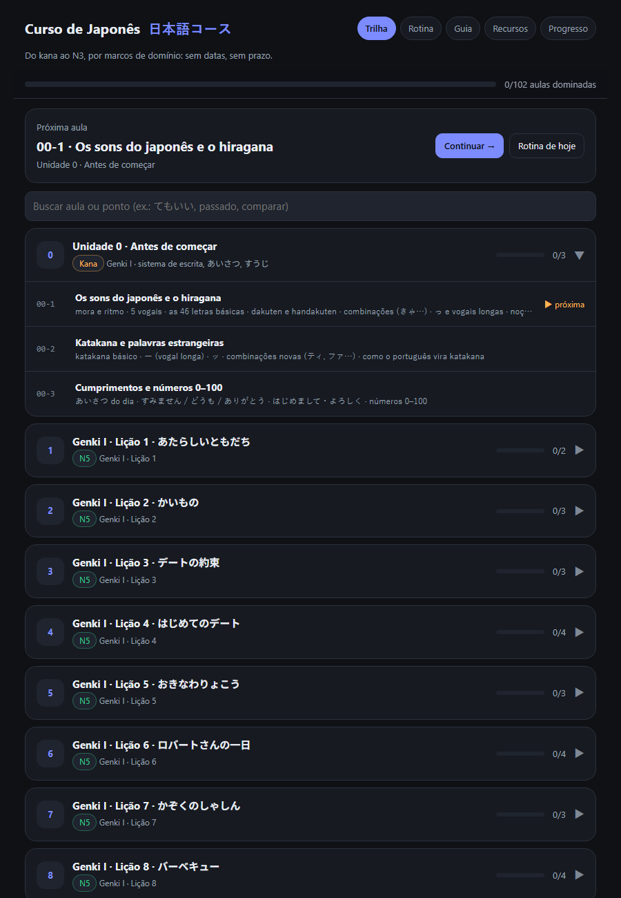
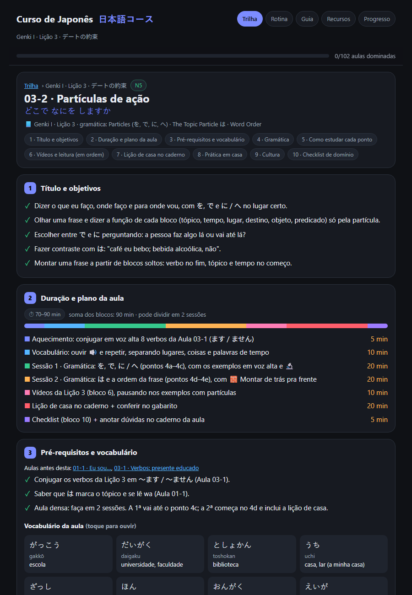
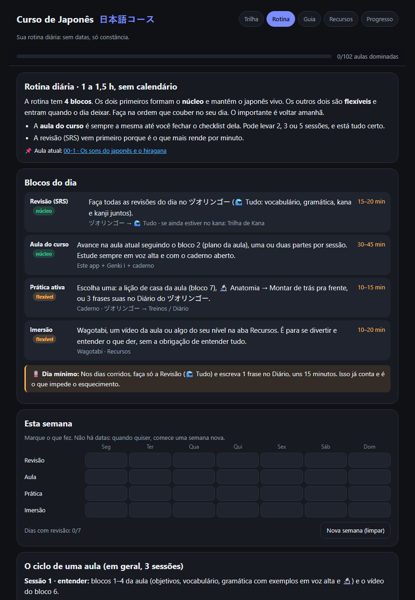

# ヅオリンゴー · 日本語コース

**A complete Japanese course taught straight from English**, from kana to N3.

- It follows **mastery milestones**: no dates, no deadlines.
- It is an offline app in **a single HTML file**. It opens with a double click, on a phone, or from the website.

**▶ Open the course:** https://gunz101.github.io/-duoringo-/

| Path | Lesson (10 blocks) | Routine |
|---|---|---|
|  |  |  |

## What's inside

- **102 lessons:**
  - Unit 0 (kana and sounds);
  - Genki I (N5) with Milestones 1–3;
  - Genki II (N4) with Milestones 4–5;
  - an N3 Bridge with Milestone 6;
  - a Travel Track (real situations in Japan).
- **Every lesson has the same 10 blocks:**
  1. goals ("I can…")
  2. time and lesson plan
  3. prerequisites and vocabulary
  4. grammar (explanation, structure, examples, pitfalls)
  5. how to study each point
  6. videos and reading, in order
  7. notebook homework **with an answer key**
  8. home practice (Wagotabi, the app, shadowing)
  9. culture (one habit per lesson)
  10. a mastery checklist
- **Every example shows Japanese, kana, romaji and English**, with two tools:
  - 🔊 to listen;
  - 🔬 **sentence anatomy**, which colors each block of the sentence by its job (topic, object, place, predicate…). It is built for learners who get lost in how sentences are put together.
- **Verified videos** linked to each lesson: ToKini Andy has one video per Genki lesson, and Game Gengo has one per grammar point.
- **Resources:** 90 free and paid materials, sorted by skill and level.
- **Study support:**
  - a **daily routine** of 1–1.5 hours, with a weekly tracker and no calendar;
  - a **guide** to following the course;
  - **progress tracking** by mastery.
- **Safe progress saving:**
  - a double copy in the browser (localStorage + IndexedDB);
  - automatic restore points;
  - an optional synced progress file (put it in OneDrive or Google Drive to share progress between PC, site and app);
  - merges that never lose a mark;
  - checksummed backups.

  A Content-Security-Policy blocks every network connection.
- It works on its own or **inside the ヅオリンゴー app** (🏫 Course tab).

## Status

**74 of 102 lessons published.** Every published lesson passes the automatic checker (`tools/check.js`: structure, romaji × kana, answer keys, no dates, kanji per lesson, no Portuguese). The rest is being written.

| Part | Lessons | |
|---|---|---|
| Unit 0 · kana | 3 / 3 | ✅ complete |
| Genki I (N5) + Milestones 1–3 | 38 / 38 | ✅ complete |
| Genki II (N4) + Milestones 4–5 | 28 / 30 | 🟡 in progress |
| N3 Bridge + Milestone 6 | 5 / 23 | 🟡 in progress |
| Travel Track | 0 / 8 | ⏳ next |

## For contributors

| Path | What it is |
|---|---|
| `index.html` | The finished app (**generated**) |
| `src/template.html` | UI (CSS + JS, no dependencies) |
| `src/store.js` | Progress storage (sanitize, merge, backups, synced file) |
| `content/curso.json` | Map of units and lessons, routine, guide |
| `content/aulas/<id>.json` | One lesson per file (the 10 blocks) |
| `content/recursos.json`, `content/videos.json` | Verified resources and videos |
| `content/AUTORIA.md` | Authoring rules |
| `tools/check.js` | Acceptance criteria: structure, romaji × kana, answer keys, no dates, kanji per lesson, no Portuguese |
| `tools/build.js` | Check + sentence anatomy → `index.html` |

```bash
npm install
node tools/test-store.js
node tools/check.js --readings
node tools/build.js
```

## Content

- All sentences, explanations, exercises and answer keys are **original**.
- The course follows the order of *Genki* (3rd ed., The Japan Times) and cites it only by lesson and grammar-point name. The *Workbook* is cited only by page and exercise title.
- No text from the books is reproduced. You need the books for their readings and exercises.
